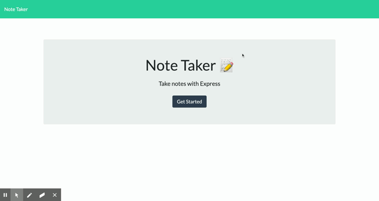

  
  # Note Taker
  
## Description
 An application that can write, save and delete notes. Uses express backend and saves and retrieve's notes from a front end. 
 
 ## App Deployment
 https://sc-note-taker.herokuapp.com/

 ## App Demo
  
 
This project was created using:  Javascript 
  
  ## Table of Contents
  - [Installation](#installation)
  - [Usage](#usage)
  - [License](#license)
  - [Contributors](#contributors)
  - [Tests](#tests)
  - [Questions](#Questions)
  ## Installation
  This application is installed by doing the following: node
  ## Usage
  For users that need to keep track of a lot of information, it's easy to forget or be unable to recall something important. Being able to take persistent notes allows users to have written information available when needed.
  

  ## License
  No licenses were used for this project
  ## Contributors
  There are no other contributors at this time.
  ## Tests
  node server.js
  # Contact
  
 
  

  
**Contact email:** bubblyrobot01@gmail.com
  
**GitHub Username:**  https://github.com/BubblyRobot
  
**Best form of contact:** email
  
G**GitHub Project link:** https://github.com/BubblyRobot/Note-Taker
  
  